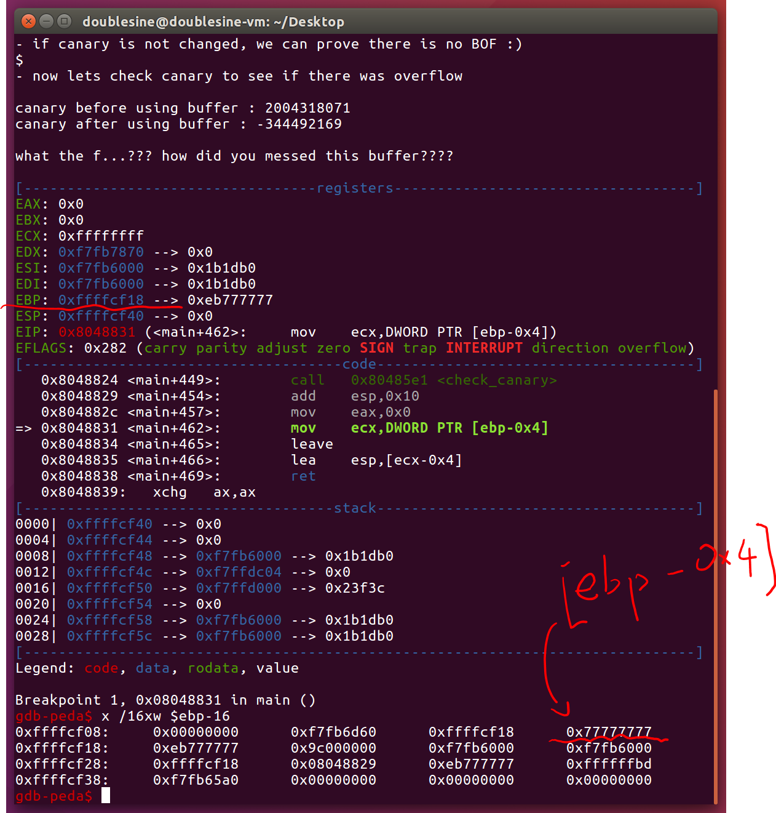

# pwnable.kr -- Rookiss -- alloca

## 1. Challenge

> Let me give you a lesson: "How to prevent buffer overflow?"  
>   
> ssh alloca@pwnable.kr -p2222 (pw:guest)  

## 2. Solution

Log in via SSH and see source code:

alloca.c
```c
#include <stdio.h>
#include <string.h>
#include <stdlib.h>

void callme(){
        system("/bin/sh");
}

void clear_newlines(){
        int c;
        do{
                c = getchar();
        }while (c != '\n' && c != EOF);
}

int g_canary;
int check_canary(int canary){
        int result = canary ^ g_canary;
        int canary_after = canary;
        int canary_before = g_canary;
        printf("canary before using buffer : %d\n", canary_before);
        printf("canary after using buffer : %d\n\n", canary_after);
        if(result != 0){
                printf("what the ....??? how did you messed this buffer????\n");
        }
        else{
                printf("I told you so. its trivially easy to prevent BOF :)\n");
                printf("therefore as you can see, it is easy to make secure software\n");
        }
        return result;
}

int size;
char* buffer;
int main(){

        printf("- BOF(buffer overflow) is very easy to prevent. here is how to.\n\n");
        sleep(1);
        printf("   1. allocate the buffer size only as you need it\n");
        printf("   2. know your buffer size and limit the input length\n\n");

        printf("- simple right?. let me show you.\n\n");
        sleep(1);

        printf("- whats the maximum length of your buffer?(byte) : ");
        scanf("%d", &size);
        clear_newlines();

        printf("- give me your random canary number to prove there is no BOF : ");
        scanf("%d", &g_canary);
        clear_newlines();

        printf("- ok lets allocate a buffer of length %d\n\n", size);
        sleep(1);

        buffer = alloca( size + 4 );    // 4 is for canary

        printf("- now, lets put canary at the end of the buffer and get your data\n");
        printf("- don't worry! fgets() securely limits your input after %d bytes :)\n", size);
        printf("- if canary is not changed, we can prove there is no BOF :)\n");
        printf("$ ");

        memcpy(buffer+size, &g_canary, 4);      // canary will detect overflow.
        fgets(buffer, size, stdin);             // there is no way you can exploit this.

        printf("\n");
        printf("- now lets check canary to see if there was overflow\n\n");

        check_canary( *((int*)(buffer+size)) );
        return 0;
}
```

We can see that ``alloca()` is call in `main()`. But variable `size` is a signed integer and we can make it negative. So I downloaded the binary file `alloca` and drop it into IDA to see what `alloca()` does. 

```
.text:08048745                 mov     eax, ds:size
.text:0804874A                 add     eax, 4
.text:0804874D                 lea     edx, [eax+0Fh]
.text:08048750                 mov     eax, 10h
.text:08048755                 sub     eax, 1
.text:08048758                 add     eax, edx
.text:0804875A                 mov     ecx, 10h
.text:0804875F                 mov     edx, 0
.text:08048764                 div     ecx
.text:08048766                 imul    eax, 10h
.text:08048769                 sub     esp, eax
.text:0804876B                 mov     eax, esp
.text:0804876D                 add     eax, 0Fh
.text:08048770                 shr     eax, 4
.text:08048773                 shl     eax, 4
.text:08048776                 mov     ds:buffer, eax
```

The assembly code above is the assembly code of `buffer = alloca(size + 4);` which is equilavent to the following C code:

```c
$esp -= (size + 34) / 16 * 16;
buffer = ($esp + 15) / 16 * 16;
```

So if size is less than `-34`, the stack pointer `esp` may goes up which would cause return address modified in the code after `buffer = alloca(size + 4);`.

Before `main()` returns, the last function called is `check_canary()` where canary we set will be read and stored on stack. If we raise `esp` by certain value, the return address of `main()` may replaced by our canary. I tried several times and found we can hijack `esp` when `size` is `-67`.



In the case of the above screenshot, I set canary to `0x7777777` which would be found easily. You can see that `esp` would be set to `canary - 0x4` before `ret` executed.

Now there is a problem. What should `esp` be set to so that program will return to `callme()` and get shell? Well, use __stack-spray__.

Because there is no bytes that is `\xab\x85\x04\x08` in the address space of binary file `alloca` and we cannot predict stack address due to ALSR, I have to use stack-spray. I build many arguments that all looks like `\xab\x85\x04\x08\xab\x85\x04\x08\xab...` and set canary to `0xFFF0DF04`, also `-991484`, then I should get shell if `esp` hit my arguments' buffer. 

```
$ gcc solve.c -o solve

# Try many times and you will get shell
# ps: I tried about 10 times.
$ ./solve
....
.... -67
.... -991484
...
```
