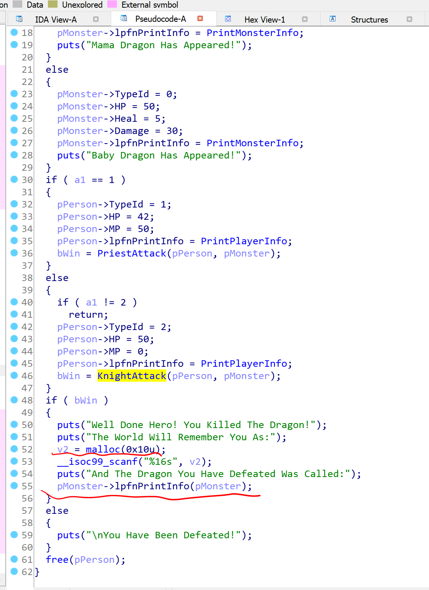

# pwnable.kr -- Rookiss -- dragon

## 1. Challenge

```
I made a RPG game for my little brother.
But to trick him, I made it impossible to win.
I hope he doesn't get too angry with me :P!

Author : rookiss
Download : http://pwnable.kr/bin/dragon

Running at : nc pwnable.kr 9004
```

## 2. Solution

A simple UAF exploit. I just give you some hints:

1. When `PriestAttack()` returns, it will free a block of memory allocated for monster. And so does `KnightAttack()`.

2. `PriestAttack()` and `KnightAttack()` will return a BOOL that indicates you win or not. If you win, the application will allocate a block of memory which has the same address with the block freed in `PriestAttack()` or `KnightAttack()`. Then you can write 16 bytes at most which can help you hijack `$eip` and get shell.

   
