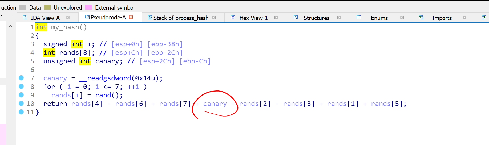
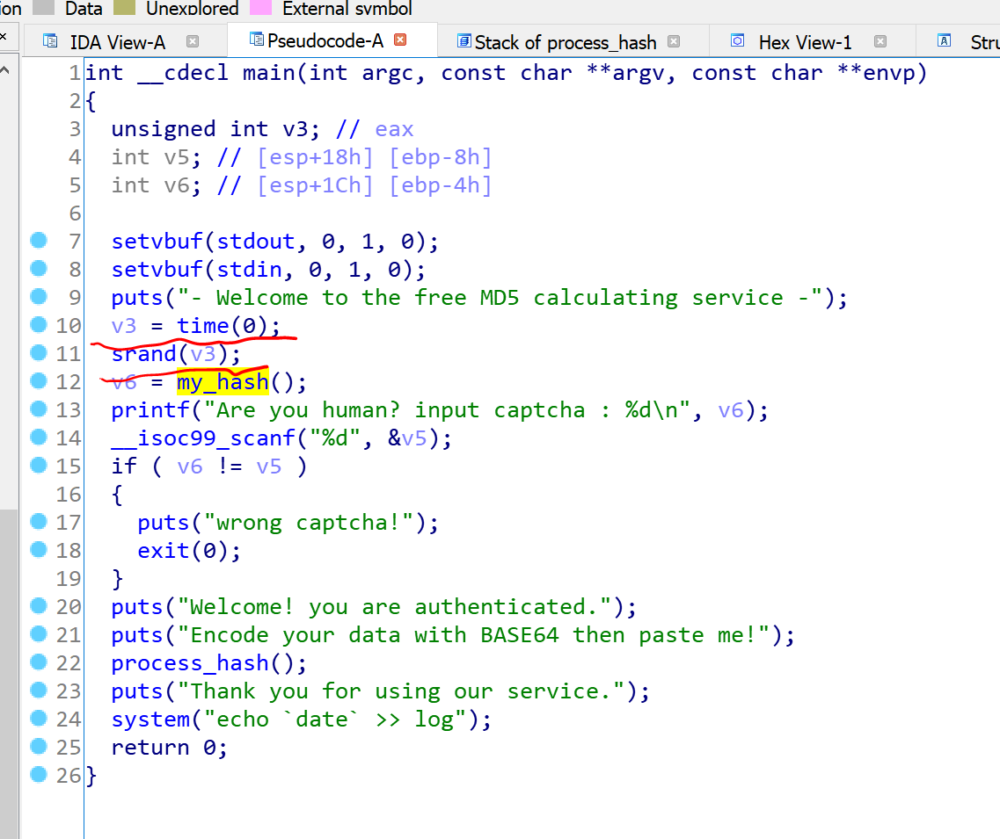
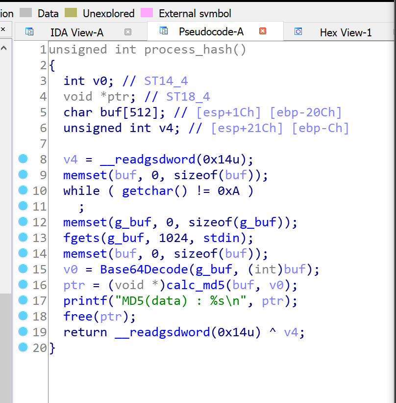
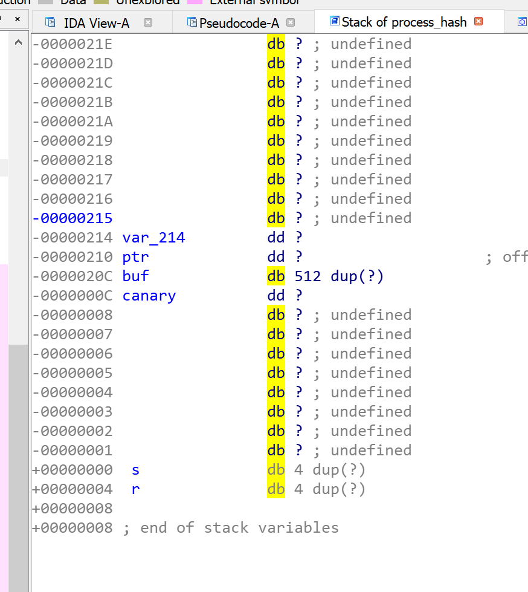

# pwnable.kr -- Rookiss -- md5 calculator

## 1. Challenge

> We made a simple MD5 calculator as a network service.  
> Find a bug and exploit it to get a shell.  
>   
> Download : http://pwnable.kr/bin/hash  
> hint : this service shares the same machine with pwnable.kr web service  
>   
> Running at : nc pwnable.kr 9002  

## 2. Solution

Download the binary file and drop it into IDA. 

The program will call `my_hash()` at first to calculate a captcha. However `canary` is involved in captcha's calculation. If we know `rands[1]` to `rands[6]`, `canary` would be leaked. 



The good news is that these random integers are predictable because the seed of them is set before `my_hash()` is called and the value is the timestamp when the program is lanuched.



There is a BOF exploit in `process_hash()`. 



We can see that `g_buf` receives a base64-encoded string and `buf` receives the base64-decoded bytes. 

But `buf` is too small. Because the size of `g_buf` is 1024 bytes which means there would be approximately `1024 * 6 // 8 = 768` bytes at most after decoded and `buf` would be overflowed.

So our solution is:

1. Calculate `canary` by the captcha given.

2. Build payload to overflow `buf`, so we can overwrite return address. Don't forget that `canary` must not be changed.



3. Where to return? I thought we can let it return to `0x08049187`. In this case, we must add an address where `/bin/sh` locates after the return address so that it would an argument passed to `system()`.

   The string `/bin/sh` can be located inside `g_buf` of which the address would never change.


   ```
   .text:08049180                 mov     dword ptr [esp], offset command ; "echo `date` >> log"
   .text:08049187                 call    _system
   .text:0804918C                 mov     eax, 0
   ```

