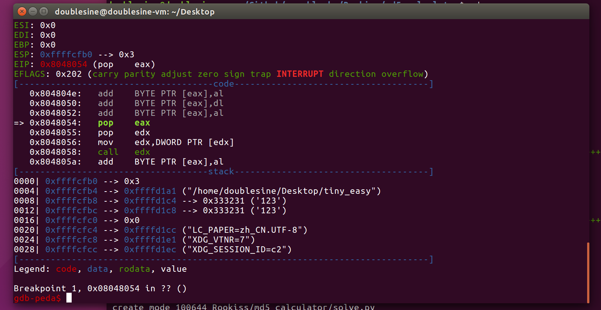

# pwnable.kr -- Rookiss -- otp

## 1. Challenge

> I made a pretty difficult pwn task.  
> However I also made a dumb rookie mistake and made it too easy :(  
> This is based on real event :) enjoy.  
>   
> ssh tiny_easy@pwnable.kr -p2222 (pw:guest)  

## 2. Solution

Log in via SSH and you will see two files: `flag` and `tiny_easy`. 

Of course you cannot see `flag`. So just download `tiny_easy` and drop it into IDA.

To my surprise, `tiny_easy` is very small and with only one function `start` which is also the entry point.

```
LOAD:08048054                 public start
LOAD:08048054 start           proc near
LOAD:08048054                 pop     eax
LOAD:08048055                 pop     edx
LOAD:08048056                 mov     edx, [edx]
LOAD:08048058                 call    edx
LOAD:08048058 start           endp ; sp-analysis failed
LOAD:08048058
LOAD:08048058 LOAD            ends
```

And the following is the screenshot where the program reaches entry point with two arguments: `"123"`, `"123"`.



So it seems that the program will finally jump to an address which is determined by the first 4 bytes of `argv[0]`.

At first glance I though I should build an ROP chain. But `tiny_easy` is too small to find an ROP chain I want.

The second way is to hijack `eip` to stack. However, due to ALSR, we cannot predict the base address of stack. But It doesn't matter because we can use __stack-spray__. 

Though we cannot know the exact value of the base address of stack, we know the approximate value of it. It should be looking like `0xFFxxxxxx`. So we can pass arguments as many as possible and the arguments are consist of many `0x90`(`nop`) and a piece of shellcode.

If the jump address we specified happends to hit `0x90`(`nop`), the program will finally slide to our shellcode. Yes, it all depends on your luck.

Upload `solve.c` to `/tmp/*` and compile. Run several times and you will get shell.

