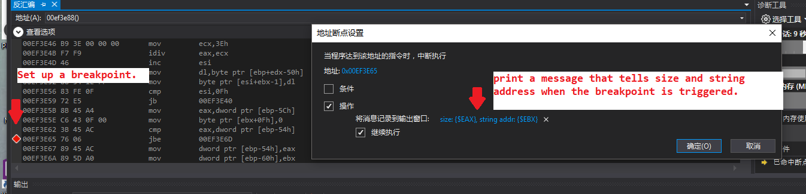
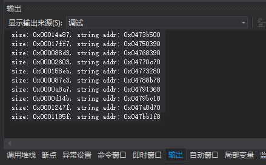
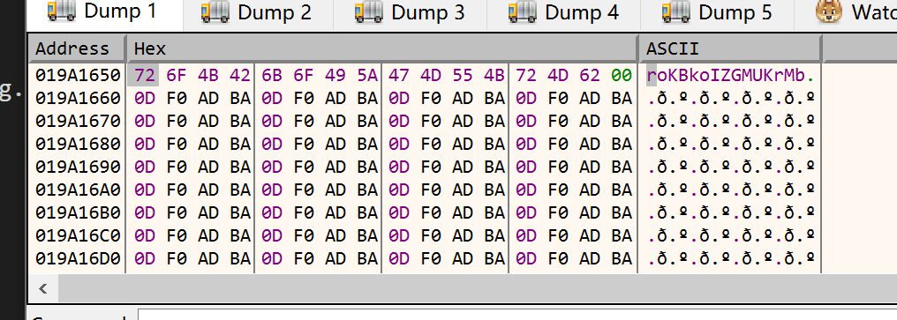
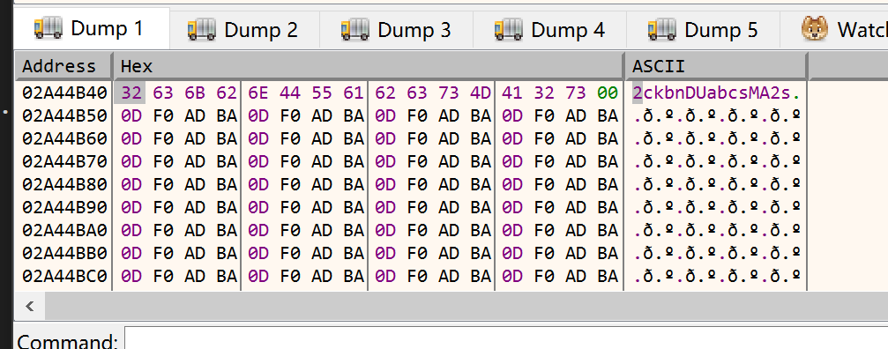

# pwnable.kr -- Toddler's Bottle -- codemap

## 1. Challenge

```
I have a binary that has a lot information inside heap.
How fast can you reverse-engineer this?
(hint: see the information inside EAX,EBX when 0x403E65 is executed)

download: http://pwnable.kr/bin/codemap.exe

ssh codemap@pwnable.kr -p2222 (pw:guest)
```

__NOTICE:__

This challenge has been removed due to quality reason.

## 2. Solution

Connect via ssh and read `readme`:

```
reverse engineer the 'codemap.exe' binary, then connect to codemap daemon(nc 0 9021),  
the daemon will ask you some question, provide the correct answer to get flag.  
```

So type `nc 0 9021` at ssh-shell to see what the questions are:

```
1. What is the string inside 2nd biggest chunk?
2. What is the string inside 3rd biggest chunk?
```

As this it a reversing task, so drop exe file `codemap.exe` into IDA. 

We can find the program will tell the first biggest chunk's size and a string inside it. However, we need strings in the second and the third biggest chunk. Of course, We can try our best to find out the algorithm of how those chunks and strings are generated. But there's a easier way. 

In function `main()`, every time a new chunk is generated, the program will check whether the size of the newly-generated chunk is bigger than the size of the current biggest chunk. If it is, the current biggest chunk will be updated.

So we can use [x32dbg](https://x64dbg.com/#start) and set up a breakpoint where the program is comparing chunks' size. Exactly speaking, it is at `main + 0x135`. Then set log text when the breakpoint is triggered:



Every time the breakpoint is triggered, you can see something printed out at `Log` window:



There wound be 1000 lines. Use python to sort them and find out the second and the third biggest chunk. 

```python
#!/usr/bin/env python3
import re

chunks = []
while True:
    line = input()
    if line == '':
        break
    else:
        chunks.append(line)

for i in range(len(chunks)):
    size, addr = re.fullmatch('size:([0-9]+),addr:([0-9A-Fa-f]{8})', chunks[i]).group(1, 2)
    size = int(size)
    addr = int(addr, 16)
    chunks[i] = (size, addr)

chunks.sort(key = lambda elem: elem[0], reverse = True)
print('2nd size: %d, addr = 0x%08x' % (chunks[1][0], chunks[1][1]))
print('3rd size: %d, addr = 0x%08x' % (chunks[2][0], chunks[2][1]))
```

Result:

```
...
...
...
size:53579,addr:03C804F8
size:74879,addr:03C8D9C0
size:71775,addr:03CA01B8

2nd size: 99679, addr = 0x019a1650
3rd size: 99662, addr = 0x02a44b40
```

Then look up memory at `0x019a1650` and `0x02a44b40`:





Now you can answer the two questions above.

