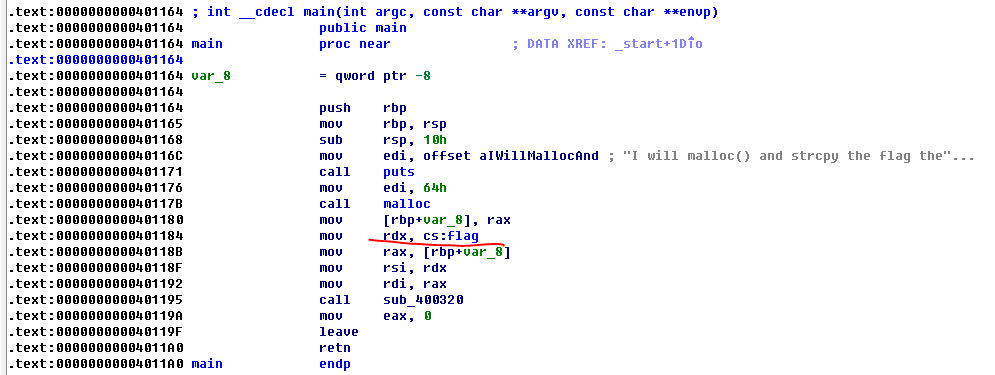
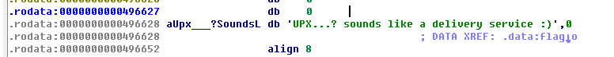

# pwnable.kr -- Toddler's Bottle -- flag
This is a reversing challenge, and the binary file is packed by UPX. Just unpack the binary file and then get the flag.

## 1. Challenge
  > Papa brought me a packed present! let's open it.
  >   
  > Download : http://pwnable.kr/bin/flag  
  >   
  > This is reversing task. all you need is binary  

## 2. Solution
  * As the challenge says it is a reversing task, let's download the binary file and open it in IDA.  
  
    

  * We can find that there are few functions, and a lot of data are unrecognizable. So it probably has been packed.

  * Let's use `Shift + F12` to open IDA's string window:  
    
      
    
  We can find there is a string about UPX, so we can assume that this binary file is probably packed by UPX.

  * Let's go to [https://upx.github.io/](https://upx.github.io/ "https://upx.github.io/") and download UPX packer.

  * Here we work in Windows and unpack the binary file:  
      ```
      D:\Tools\upx394w>upx -d flag -o flag.unpacked
                             Ultimate Packer for eXecutables
                                Copyright (C) 1996 - 2017
      UPX 3.94w       Markus Oberhumer, Laszlo Molnar & John Reiser   May 12th 2017

              File size         Ratio      Format      Name
         --------------------   ------   -----------   -----------
          883745 <-    335288   37.94%   linux/amd64   flag.unpacked

      Unpacked 1 file.

      D:\Tools\upx394w>
      ```

  * Then we open the output file `flag.unpacked` in IDA. Now the binary can be analyzed normally.  

  * Just goto function `main`, we can see there is a global variable named `flag`:  
  
    
  

  * Follow the variable, you will see the flag is:
  
    
  
