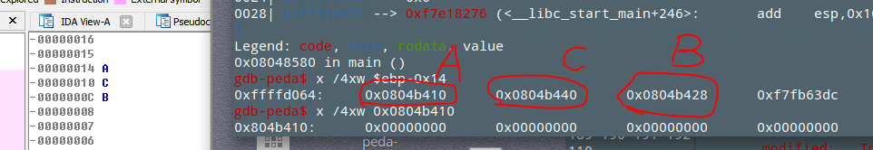
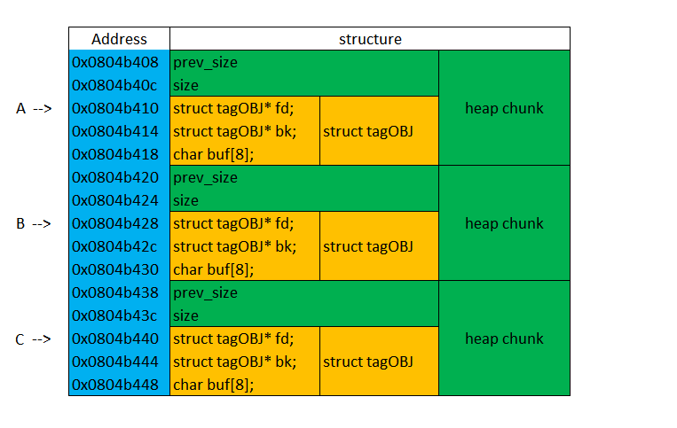

# pwnable.kr -- Toddler's Bottle -- unlink

## 1. Challenge

```
Daddy! how can I exploit unlink corruption?

ssh unlink@pwnable.kr -p2222 (pw: guest)
```

## 2. Solution

Connect target via ssh and see source code:

```c
#include <stdio.h>
#include <stdlib.h>
#include <string.h>
typedef struct tagOBJ{
    struct tagOBJ* fd;
    struct tagOBJ* bk;
    char buf[8];
} OBJ;

void shell(){
    system("/bin/sh");
}

void unlink(OBJ* P){
    OBJ* BK;
    OBJ* FD;
    BK=P->bk;
    FD=P->fd;
    FD->bk=BK;
    BK->fd=FD;
}
int main(int argc, char* argv[]){
    malloc(1024);
    OBJ* A = (OBJ*)malloc(sizeof(OBJ));
    OBJ* B = (OBJ*)malloc(sizeof(OBJ));
    OBJ* C = (OBJ*)malloc(sizeof(OBJ));

    // double linked list: A <-> B <-> C
    A->fd = B;
    B->bk = A;
    B->fd = C;
    C->bk = B;

    printf("here is stack address leak: %p\n", &A);
    printf("here is heap address leak: %p\n", A);
    printf("now that you have leaks, get shell!\n");
    // heap overflow!
    gets(A->buf);

    // exploit this unlink!
    unlink(B);
    return 0;
}
```

We can see the program call `gets()` function at `main()`. So we can overflow it.

In gdb, we can see the value of `A`, `B`, `C`:



We can see that object A is allocated first, then C is allocated and last it is B. So in heap memory, the layout would be:



If we change object `B`'s `fd` and `bk`, then in the function `unlink()`, data at a pair of wrong addresses would be changed,

We also notice that at the end of function `main()`, there is:

```asm
mov     ecx, [ebp - 0x4]
leave
lea     esp, [ecx - 0x4]
ret
```

So if we change the data at `ebp - 0x4` which is equivalent to `&A + 0x10`, we can make `esp` point to heap area. Then after `ret`, we can hijack `eip`.
